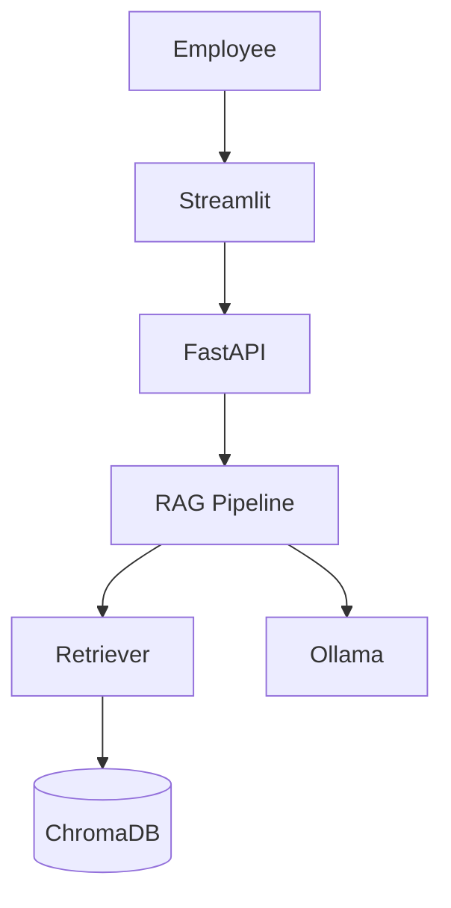

# Sage — Employee AI Assistant

Sage is a Retrieval-Augmented Generation (RAG) assistant for internal
company knowledge. Employees ask natural-language questions about HR
policies, SOPs, and handbooks; Sage retrieves the most relevant document
chunks and uses a locally-running LLM to generate a grounded, cited
answer — or says clearly when it doesn't know, instead of guessing. Admins
manage the underlying documents through the same UI.

This repository is also the codebase for a YouTube course that evolves
Sage step by step, from this minimal working RAG app toward a full
agentic assistant. See [Course Evolution](#course-evolution) below.

## What Sage Does

- Employees ask questions in a chat UI and get grounded answers with
  source citations.
- Admins upload PDF/DOCX/TXT/Markdown documents and manage what's indexed.
- Every answer is either backed by the indexed documents, or Sage says it
  doesn't have that information — it doesn't guess.
- Employees can rate answers (👍/👎) to build a feedback signal for later
  improvement.
- Everything runs locally in Docker: no external API key, no data leaving
  the machine.

## Current Version — V0.1 RAG MVP

This is the foundation version: a working end-to-end RAG pipeline with a
Streamlit UI, FastAPI backend, ChromaDB vector store, and a local LLM via
Ollama. It's intentionally simple — see
[Current Limitations](#current-limitations) for what it doesn't do yet.

## Demo Capabilities

- Document ingestion (PDF, DOCX, TXT, Markdown) with chunking + embedding
- Semantic search over indexed documents (ChromaDB)
- Grounded question answering with source citations
- Local LLM generation via Ollama — no external API key required
- Thumbs-up/down feedback capture per answer
- Admin document management (upload, list, remove) from the same UI
- `GET /health` reporting service status, app version, LLM reachability,
  and indexed document count

## Architecture



Full architecture detail, including the ingestion flow and a query
sequence diagram, lives in [`docs/architecture.md`](docs/architecture.md).

## Tech Stack

| Layer | Technology |
|---|---|
| Frontend | Streamlit |
| Backend API | FastAPI |
| RAG orchestration | Plain Python (`backend/app/core/`) |
| Vector store | ChromaDB (persisted volume) |
| Embeddings | sentence-transformers (`all-MiniLM-L6-v2`, local) |
| LLM | Ollama (local, model configurable via `OLLAMA_MODEL`) |
| Containerization | Docker + Docker Compose |
| Testing | pytest |

## Project Structure

```
employee-kb-rag/
├── backend/                  FastAPI app + RAG pipeline
│   ├── app/api/               HTTP routes
│   ├── app/core/               loaders, chunking, embeddings, vectorstore,
│   │                          llm_local, rag_pipeline
│   ├── app/models/schemas.py  Pydantic request/response models
│   └── tests/                 pytest suite
├── frontend/                 Streamlit chat UI + admin sidebar
├── data/raw_docs/            Sample HR documents
├── data/chroma_db/           Persisted vector store (Docker volume)
├── docs/                     Architecture, RAG pipeline, roadmap, archive
├── scripts/smoke_test.py     Live end-to-end smoke test
└── docker-compose.yml
```

## How RAG Works

```
Load → Clean → Chunk → Embed → Store → Retrieve → Build prompt → Generate → Return answer + sources
```

Each step is explained in detail, with the exact file responsible for it,
in [`docs/rag-pipeline.md`](docs/rag-pipeline.md).

## Running Locally

For development without Docker (backend and frontend run as plain Python
processes; Ollama still needs to be running somewhere):

1. Install and start [Ollama](https://ollama.com) locally: `ollama serve`.
2. Backend:
   ```bash
   cd backend
   python -m venv .venv && .venv/Scripts/activate  # or source .venv/bin/activate
   pip install -r requirements.txt
   set OLLAMA_BASE_URL=http://localhost:11434       # PowerShell: $env:OLLAMA_BASE_URL=...
   set CHROMA_PERSIST_DIR=./data/chroma_db
   uvicorn app.main:app --reload --port 8000
   ```
3. Frontend (separate terminal):
   ```bash
   cd frontend
   python -m venv .venv && .venv/Scripts/activate
   pip install -r requirements.txt
   set BACKEND_URL=http://localhost:8000
   streamlit run streamlit_app.py
   ```
4. Open the app at [http://localhost:8501](http://localhost:8501).

## Running with Docker

1. (Optional) Copy the environment template if you want to override any
   defaults, e.g. to use a different local model:

   ```bash
   cp .env.example .env
   ```

   No values need to change for a first run — everything, including the
   LLM, runs locally with sensible defaults.

2. Build and start the stack:

   ```bash
   docker compose up --build
   ```

   On first run, the backend downloads the embedding model, and the local
   LLM is pulled the first time you ask a question (not at startup) — so
   your very first question will take longer than usual while the model
   downloads. Both models are cached in Docker volumes, so this only
   happens once.

3. Once all services are healthy, open the app at
   [http://localhost:8501](http://localhost:8501).

The repo ships with a few sample HR documents in `data/raw_docs/`
(`leave_policy.md`, `code_of_conduct.md`, `it_helpdesk_sop.md`) — upload
them through the sidebar's **Manage Knowledge Base** section to have
something to query right away.

### Troubleshooting

**"Could not reach the local LLM service" / model pull failures**
Check `docker compose ps` to confirm the `ollama` container is healthy,
and check its logs (`docker compose logs ollama`) for pull errors — the
most common cause is insufficient disk space or an interrupted download on
first run. Retrying `docker compose up` will resume the pull, since the
partially-downloaded model is cached in the `ollama_data` volume.

**"I couldn't find this in the knowledge base" for everything**
The vector store is empty or doesn't contain anything relevant to your
question. Upload at least one document via the sidebar and try again. You
can confirm what's indexed via the **Indexed Documents** list in the
sidebar or `GET /health`, which reports `indexed_documents`.

**Port conflicts (`8000` or `8501` already in use)**
Another process on your machine is already using one of the ports Docker
Compose tries to bind. Either stop that process, or edit the port mappings
in `docker-compose.yml` (e.g. change `"8501:8501"` to `"8502:8501"`) and
access the app on the new host port instead.

## Sample Questions

Once the sample documents are uploaded, try asking:

- "How many days of annual leave do employees get?"
- "What should I do if I witness a conflict of interest?"
- "What are the IT helpdesk support hours?"
- "How do I request new equipment?"

And to see the "I don't know" path in action, ask something out of scope,
e.g. "What is the capital of France?" — Sage should say it can't find that
in the knowledge base rather than answering from general knowledge.

## Running Tests

Backend unit tests (chunking, retrieval, local LLM wrapper, and the RAG
pipeline) run with `pytest` from inside the `backend/` directory:

```bash
cd backend
pip install -r requirements.txt
pytest tests/
```

An end-to-end smoke test is also available once the stack is running via
Docker Compose:

```bash
python scripts/smoke_test.py
```

It ingests a sample document, asks a question about it, and prints a clear
`PASS`/`FAIL` summary. Set `BACKEND_URL` if the backend isn't at the
default `http://localhost:8000`.

## Course Evolution

Sage is built progressively across a YouTube course. Full detail (what
each version adds, in what order) is in
[`docs/course-roadmap.md`](docs/course-roadmap.md); summary:

| Version | Focus |
|---|---|
| **V0.1 — RAG MVP** *(current)* | Streamlit, FastAPI, Chroma, Ollama, citations, ingestion |
| V0.2 — RAG Engineering | Richer metadata, page-aware citations, better chunking, retrieval eval, hybrid retrieval, reranking |
| V0.3 — Product UI | React + TypeScript + Vite + Tailwind, streaming responses, chat history UI, source cards |
| V0.4 — AI Tools | Policy search, employee directory, leave balance, IT ticket creation |
| V0.5 — Agent | LangGraph, tool routing, conversation state, human approval, persistence |
| V0.6 — MCP | Expose Sage's tools via MCP for external clients |
| V1.0 — Production Course Version | Full Docker stack, tests, evaluation, logging, security, polished docs |

## Current Limitations

V0.1 is intentionally simple. Known limitations (each a candidate future
lesson) are detailed in
[`docs/rag-pipeline.md`](docs/rag-pipeline.md#known-limitations):
character-based chunking, limited citation metadata, no page-aware PDF
metadata, dense retrieval only, no reranker, a simple global similarity
threshold, no formal evaluation dataset, frontend-only conversation
history, and direct coupling to Ollama (no provider abstraction yet).

Operationally: local CPU inference is slow (seconds to a couple of
minutes per answer depending on model/hardware) and there is no
authentication — see [`TECHNICAL_DOCUMENTATION.md`](TECHNICAL_DOCUMENTATION.md)
for the full developer-facing writeup, including model comparison notes.

## Roadmap

The immediate next phase (V0.2 — RAG Engineering) focuses on strengthening
the retrieval foundation — richer metadata, real chunking/retrieval
evaluation, and reranking — before the frontend is rebuilt in React
(V0.3) and agentic behavior (LangGraph, tools, MCP) is layered on top in
V0.4–V0.6. See [`docs/course-roadmap.md`](docs/course-roadmap.md) for the
complete plan.

## Repository Checkpoints

As the course progresses, each completed version will be marked with a
Git tag so you can check out exactly the state of the code at that stage:

```text
v0.1-rag-mvp
v0.2-rag-engineering
v0.3-react-ui
v0.4-tools
v0.5-langgraph-agent
v0.6-mcp
v1.0-course
```

**None of these tags exist yet** — this repository is currently at the
V0.1 foundation, prior to the `v0.1-rag-mvp` checkpoint being cut. Once
tags start landing, this section will be updated with instructions for
checking out a specific version (`git checkout <tag>`).
