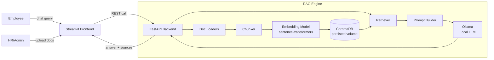

# employee-kb-rag

An intelligent Employee Knowledge Base powered by Retrieval-Augmented
Generation (RAG). Employees can ask natural-language questions about HR
policies, SOPs, and handbooks; the app retrieves the most relevant document
chunks and uses an LLM to generate a grounded, cited answer. Admins can
upload and manage the underlying documents through the same UI.

The stack is fully Dockerized and runs entirely on your own machine, with no
external API keys: a **Streamlit** frontend, a **FastAPI** backend/RAG
engine, a **ChromaDB** vector store, and **Ollama** running a lightweight
local LLM for generation.

## Architecture



**Query flow:** an employee asks a question → the backend embeds the query →
retrieves the top-k relevant chunks from Chroma → builds a grounded prompt →
the local LLM (via Ollama) generates the answer → the backend returns the
answer plus source citations → Streamlit displays it.

**Ingestion flow:** an admin uploads an HR policy/SOP/handbook file → the
backend loads it → chunks it → embeds the chunks → stores them in Chroma
(persisted to a Docker volume).

> Embeddings are generated locally with `sentence-transformers`, and answer
> generation runs locally through [Ollama](https://ollama.com) — nothing
> leaves your machine, and no API key is required. The model is configurable
> via `OLLAMA_MODEL`; any model from the
> [Ollama library](https://ollama.com/library) can be swapped in.

## Prerequisites

- [Docker](https://www.docker.com/) and Docker Compose (bundled with Docker
  Desktop)
- About 1-1.5GB of free disk space for the local LLM (the default model,
  `qwen2.5:1.5b`, is chosen to run reasonably on CPU-only machines). Answer
  generation runs locally, so response time depends on your CPU — expect
  anywhere from several seconds to a couple of minutes per question. For
  better answer quality (at the cost of speed), swap `OLLAMA_MODEL` to
  `llama3.2:3b` or larger if your machine has more RAM/CPU to spare.

## Setup

1. (Optional) Copy the environment template if you want to override any
   defaults, e.g. to use a different local model:

   ```bash
   cp .env.example .env
   ```

   No values need to change for a first run — everything, including the
   LLM, runs locally with sensible defaults.

2. Build and start the stack:

   ```bash
   docker compose up --build
   ```

   On first run, the backend downloads the embedding model, and the local
   LLM is pulled the first time you ask a question (not at startup) — so
   your very first question will take longer than usual while the model
   downloads. Both models are cached in Docker volumes, so this only
   happens once.

3. Once all services are healthy, open the app at
   [http://localhost:8501](http://localhost:8501).

The repo ships with a few sample HR documents in `data/raw_docs/`
(`leave_policy.md`, `code_of_conduct.md`, `it_helpdesk_sop.md`) so you have
something to query right away — upload them through the UI as described
below, or point the ingestion pipeline at them directly.

## Uploading documents

In the Streamlit sidebar, under **Manage Knowledge Base**:

1. Use the file uploader to choose a `.pdf`, `.docx`, `.txt`, or `.md` file.
2. Click **Upload**. You'll see a toast confirming the number of chunks
   added to the knowledge base.
3. The **Indexed Documents** list below shows every document currently in
   the knowledge base, each with a **Remove** button to delete it.

## Asking questions

Type a question into the chat box at the bottom of the main page. The
assistant will:

- Answer using only the content found in the knowledge base.
- Say clearly when it doesn't have the information, rather than guessing.
- Show an expandable **Sources** section under its answer listing which
  documents it drew from.

Chat history persists for the duration of your browser session.

> Answers are generated by a local LLM running on your own CPU, so each
> response can take anywhere from a few seconds to a couple of minutes
> depending on your machine — this is expected, not a bug.

## Running tests

Backend unit tests (chunking, retrieval, and the RAG pipeline) run with
`pytest` from inside the `backend/` directory:

```bash
cd backend
pip install -r requirements.txt
pytest tests/
```

An end-to-end smoke test is also available once the stack is running via
Docker Compose:

```bash
python scripts/smoke_test.py
```

It ingests a sample document, asks a question about it, and prints a clear
`PASS`/`FAIL` summary. Set `BACKEND_URL` if the backend isn't at the default
`http://localhost:8000`.

## Troubleshooting

**"Could not reach the local LLM service" / model pull failures**
This means the backend couldn't reach the `ollama` service or failed to pull
the configured model. Check `docker compose ps` to confirm the `ollama`
container is healthy, and check its logs (`docker compose logs ollama`) for
pull errors — the most common cause is insufficient disk space or an
interrupted download on first run. Retrying `docker compose up` will resume
the pull, since the partially-downloaded model is cached in the
`ollama_data` volume.

**"I couldn't find this in the knowledge base" for everything**
This means the vector store is empty or doesn't contain anything relevant to
your question. Upload at least one document via the sidebar (or ingest the
sample documents in `data/raw_docs/`) and try again. You can confirm what's
indexed via the **Indexed Documents** list in the sidebar or by calling
`GET /health` on the backend, which reports `indexed_documents`.

**Port conflicts (`8000` or `8501` already in use)**
Another process on your machine is already using one of the ports Docker
Compose tries to bind. Either stop that process, or edit the port mappings
in `docker-compose.yml` (e.g. change `"8501:8501"` to `"8502:8501"`) and
access the app on the new host port instead.
