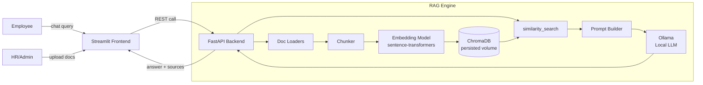

# Sage v0.1 — RAG MVP: Technical Documentation

This document explains the system end-to-end for a developer picking up the
codebase: what each piece does, how data flows through it, why certain
decisions were made, and where the rough edges are. For user-facing setup
instructions, see [README.md](README.md).

---

## 1. What this is

Sage is a Retrieval-Augmented Generation (RAG) knowledge assistant for
internal HR/SOP documents. An admin uploads policy documents (PDF/DOCX/TXT/MD);
employees ask natural-language questions in a chat UI; the system retrieves
the most relevant chunks of those documents and uses a locally-running LLM
to compose a grounded, cited answer — or explicitly says it doesn't know,
rather than guessing.

The whole stack runs in Docker on a single machine with no external API
dependency: embeddings and generation both run locally (embeddings via
`sentence-transformers`, generation via [Ollama](https://ollama.com)).

**Stack:** FastAPI (backend/RAG engine) · Streamlit (frontend) · ChromaDB
(vector store) · sentence-transformers (embeddings) · Ollama (local LLM).

---

## 2. Architecture



Three Docker Compose services, each in its own container:

| Service    | Image / build          | Port (host) | Role                                      |
|------------|-------------------------|--------------|--------------------------------------------|
| `ollama`   | `ollama/ollama:latest`  | (internal only, 11434) | Runs the local LLM, exposes a REST API |
| `backend`  | `./backend/Dockerfile`  | 8000         | FastAPI app: ingestion, retrieval, generation orchestration |
| `frontend` | `./frontend/Dockerfile` | 8501         | Streamlit chat UI + admin document manager |

All three share a bridge network (`kb-network`) and reach each other by
service name (`http://backend:8000`, `http://ollama:11434`).

---

## 3. Repository layout

```
employee-kb-rag/
├── backend/
│   ├── app/
│   │   ├── main.py                 FastAPI app, CORS, startup log, global exception handler
│   │   ├── api/
│   │   │   ├── routes_health.py    GET  /health
│   │   │   ├── routes_ingest.py    POST /ingest
│   │   │   ├── routes_query.py     POST /query
│   │   │   ├── routes_documents.py GET /documents, DELETE /documents/{filename}
│   │   │   └── routes_feedback.py  POST /feedback
│   │   ├── core/
│   │   │   ├── config.py           Settings (env-driven), singleton `settings`
│   │   │   ├── loaders.py          PDF/DOCX/TXT/MD → plain text
│   │   │   ├── chunking.py         Text → overlapping chunks
│   │   │   ├── embeddings.py       sentence-transformers wrapper
│   │   │   ├── vectorstore.py      ChromaDB wrapper (add/search/list/delete)
│   │   │   ├── llm_local.py        Ollama client wrapper (generation)
│   │   │   ├── rag_pipeline.py     Orchestrates ingest_document() and answer_query()
│   │   │   └── retriever.py        Unused placeholder — see §9
│   │   ├── models/schemas.py       Pydantic request/response models
│   │   └── utils/logger.py         Structured logging setup
│   ├── tests/                      pytest suite (see §8)
│   ├── requirements.txt
│   └── Dockerfile
├── frontend/
│   ├── streamlit_app.py            Entry point: page config, wires sidebar + chat
│   ├── components/
│   │   ├── chat_ui.py              Chat history, POST /query, feedback widget
│   │   ├── sidebar_upload.py       Upload form, indexed-document list/remove
│   │   └── source_display.py       "Sources" expander under assistant messages
│   ├── requirements.txt
│   └── Dockerfile
├── data/
│   ├── raw_docs/                   Sample HR docs (leave_policy.md, code_of_conduct.md, it_helpdesk_sop.md)
│   └── chroma_db/                  Persisted vector store (bind-mounted volume)
├── scripts/smoke_test.py           Live end-to-end smoke test against a running stack
├── docker-compose.yml
├── .env.example
└── README.md
```

---

## 4. Data flow

### 4.1 Ingestion (`POST /ingest`)

```
UploadFile
  → routes_ingest.ingest()          validate extension + size, write to temp file
  → rag_pipeline.ingest_document()
      → loaders.load_document()     dispatch by extension, extract + clean text
      → chunking.chunk_text()       character-based overlapping chunks + metadata
      → vectorstore.add_chunks()
          → embeddings.embed_texts()  sentence-transformers encode
          → Chroma collection.upsert() (id = sha256(source::chunk_index), stable across re-ingests)
  → IngestResponse {filename, chunks_added}
```

- **Validation** (`routes_ingest.py`): extension must be one of `.pdf/.docx/.txt/.md`
  (400 if not), size must be under `settings.MAX_UPLOAD_MB` (400 if not).
- **Empty-text guard** (`rag_pipeline.py`): if `load_document()` returns only
  whitespace, `DocumentIngestionError` is raised and mapped to a 422.
- **Chunking** (`chunking.py`): character-based sliding window,
  `chunk_size`/`chunk_overlap` default from `settings.CHUNK_SIZE`/`CHUNK_OVERLAP`
  (800/120). Text shorter than `chunk_size` becomes a single chunk. Each
  chunk carries `metadata = {"source": filename, "chunk_index": i}`.
- **Stable IDs** (`vectorstore.py`): `_chunk_id()` hashes `source::chunk_index`,
  so re-ingesting the same file with the same chunking parameters upserts in
  place rather than duplicating.

### 4.2 Query (`POST /query`)

```
QueryRequest {question}
  → routes_query.query()
  → rag_pipeline.answer_query()
      → vectorstore.similarity_search(query, k=TOP_K)
      → filter out chunks with score < MIN_SIMILARITY_SCORE   ← grounding guard, see §7
      → if nothing left: return the "couldn't find this" fallback, skip the LLM entirely
      → else: build system + user prompt, call llm_local.generate_answer()
      → dedupe sources by filename (first chunk_index per file, in rank order)
  → QueryResponse {answer, sources}
```

- **Retrieval**: `vectorstore.similarity_search()` embeds the query, runs
  `collection.query()`, and returns `{text, metadata, score}` per chunk,
  where `score = 1 - distance` (Chroma's default distance metric here is
  **not** bounded to [0,1] — see §7 for why the threshold default is `-0.5`,
  not `0`).
- **Prompt construction** (`rag_pipeline._build_user_prompt`): retrieved
  chunks are numbered `[1]`, `[2]`, ... and concatenated under a `Context:`
  header, followed by `Question: {query}`. The system prompt instructs the
  model to answer only from context and to say so when it can't.
- **Source dedup**: `_deduped_sources()` collapses multiple chunks from the
  same file down to one `SourceRef` (keeping the first `chunk_index`
  encountered, i.e. the highest-ranked one for that file).
- **Error handling**: `llm_local.RAGGenerationError` (unreachable Ollama,
  failed pull, failed chat call) propagates up uncaught through
  `routes_query` and is caught by the global exception handler in
  `main.py`, which logs it and returns a clean `500 {"detail": "Internal
  server error."}` instead of a stack trace.

---

## 5. Core module reference

### `config.py` — `Settings` / `settings`

A `pydantic_settings.BaseSettings` subclass, loaded from environment
variables and/or a `.env` file at the repo root (`env_file=".env"`, resolved
relative to the process's working directory — inside the backend container
that's `/app`, and `.env` is supplied via `docker-compose.yml`'s
`env_file:` directive, not baked into the image).

| Field | Default | Purpose |
|---|---|---|
| `OLLAMA_BASE_URL` | `http://ollama:11434` | Where the backend reaches the Ollama service |
| `OLLAMA_MODEL` | `qwen2.5:1.5b` | Model tag pulled/used for generation — any [Ollama library](https://ollama.com/library) model works |
| `EMBEDDING_MODEL` | `sentence-transformers/all-MiniLM-L6-v2` | HuggingFace model id for embeddings |
| `CHROMA_PERSIST_DIR` | `/app/data/chroma_db` | Chroma's on-disk persistence path (bind-mounted) |
| `CHUNK_SIZE` / `CHUNK_OVERLAP` | `800` / `120` | Chunking window, in characters |
| `TOP_K` | `5` | Chunks retrieved per query, before threshold filtering |
| `MIN_SIMILARITY_SCORE` | `-0.5` | Grounding guard — see §7 |
| `MAX_UPLOAD_MB` | `20` | Upload size cap enforced in `routes_ingest.py` |

Every field has a default, so `docker compose up` works with zero `.env`
edits. `settings = Settings()` is a module-level singleton — every other
module imports it directly (`from app.core.config import settings`) rather
than constructing its own instance. **Caveat:** because it's instantiated
once at import time, changing an env var requires restarting the process
(the tests exploit this — see §8, `test_retriever.py`'s `importlib.reload`
trick).

### `loaders.py`

Extension-dispatched text extraction: `.pdf` via `pypdf`, `.docx` via
`python-docx`, `.txt`/`.md` read directly. `load_document()` is the single
entry point; unsupported extensions raise `ValueError`. `_clean_text()`
collapses runs of whitespace/blank lines and strips each line.

### `chunking.py`

`chunk_text(text, chunk_size=None, chunk_overlap=None, metadata=None)` —
pure function, no I/O. Falls back to `settings.CHUNK_SIZE`/`CHUNK_OVERLAP`
when not passed explicitly. Character-based (not token-based) sliding
window with a `step = chunk_size - chunk_overlap` stride. Returns `[]` for
empty/whitespace-only input; returns a single chunk if the text already
fits under `chunk_size`.

### `embeddings.py`

Loads `SentenceTransformer(settings.EMBEDDING_MODEL)` once at module import
(this is the "download embedding model" step you see in backend startup
logs on a fresh container). `embed_texts()` (batch) and `embed_query()`
(single string) both return plain Python lists (`.tolist()`), since
ChromaDB's client expects JSON-serializable embeddings, not numpy arrays.

### `vectorstore.py`

Thin wrapper around a single `chromadb.PersistentClient` and a single
collection named `"employee_kb"` — there's no multi-tenancy or per-user
isolation; the whole system shares one flat namespace of documents.

- `add_chunks(chunks)` — embeds and `upsert()`s in one batch call.
- `similarity_search(query, k)` — returns ranked `{text, metadata, score}`.
- `list_sources()` — distinct `source` values across all stored metadata
  (used by `GET /documents` and the sidebar).
- `delete_source(filename)` — `collection.delete(where={"source": filename})`.

### `llm_local.py`

Wraps the official `ollama` Python client (`ollama.Client(host=...)`).
Two important design choices, both driven by lessons learned integrating
this against a real Ollama instance:

1. **Lazy model readiness, not eager.** `ollama.Client()` itself makes no
   network call at construction — so importing this module (and therefore
   `rag_pipeline`, and therefore `main`) never requires a live Ollama
   server. The actual "is the model present, and if not, pull it" check
   (`_ensure_model_available()`) runs on the **first call** to
   `generate_answer()`, guarded by a module-level `_model_ready` flag so
   subsequent calls skip the check entirely. This matters for two reasons:
   it keeps the module safely importable in unit tests without mocking a
   server, and it means `docker compose up` doesn't block on a multi-GB
   model download — the *first user query* pays that cost, not container
   startup.
2. **Every failure mode collapses to `RAGGenerationError`.** Connection
   refused, pull failure, chat-call failure — all wrapped with a message
   that tells an operator to check whether the `ollama` container is
   running, rather than leaking a raw `httpx`/`ollama` exception up through
   the API.

`is_reachable()` is a separate, cheap `client.list()` probe used by
`GET /health` — it does not touch `_model_ready` or trigger a pull.

### `rag_pipeline.py`

The only module that composes the others into the two real use cases:
`ingest_document()` and `answer_query()`. See §4 for the flow; the one
piece of logic worth calling out again here is the `MIN_SIMILARITY_SCORE`
filter — it's a one-line addition to `answer_query()` but it's the
project's actual grounding mechanism (§7).

### `main.py`

- CORS is hard-coded to the two origins the frontend can be reached from
  (`localhost:8501` for host-browser access, `frontend:8501` for
  container-to-container — though the frontend never calls the backend
  cross-origin from JS, this is defensive/vestigial from earlier iteration).
- `startup` event just logs the resolved Ollama config — it does **not**
  eagerly warm up the model (see `llm_local.py` above).
- A single `@app.exception_handler(Exception)` is the last line of defense
  against unhandled exceptions anywhere in a route.

### `schemas.py`

Plain Pydantic models, no business logic. `SourceRef` is reused by both
`QueryResponse.sources` and `FeedbackRequest.sources`. `FeedbackRequest.rating`
is a `Literal["up", "down"]` — anything else is rejected with a 422 before
the handler even runs.

### `utils/logger.py`

`get_logger(name)` returns a standard-library logger configured once via
`logging.basicConfig` at import time, level from `LOG_LEVEL` env var
(default `INFO`). Every backend module that logs calls this instead of
`logging.getLogger` directly, for a consistent format
(`timestamp | LEVEL | module.path | message`).

---

## 6. API surface

| Method & path | Request | Response | Notes |
|---|---|---|---|
| `GET /health` | — | `{status, llm_backend_reachable, indexed_documents}` | `llm_backend_reachable` pings Ollama live, not cached |
| `POST /ingest` | multipart file | `{filename, chunks_added}` | 400 bad extension/too large, 422 no extractable text |
| `POST /query` | `{question}` | `{answer, sources: [{filename, chunk_index}]}` | see §4.2 |
| `GET /documents` | — | `{sources: [filename, ...]}` | |
| `DELETE /documents/{filename}` | — | `{detail}` | idempotent — deleting a non-existent source is a no-op 200 |
| `POST /feedback` | `{question, answer, rating, sources}` | `{detail}` | appends one JSON line to `feedback.log`, see §9 |

FastAPI's auto-generated docs are available at `/docs` on the backend
(`http://localhost:8000/docs`) for interactive exploration.

---

## 7. The grounding problem, and how it's actually solved

Early in this project, generation ran on Groq's cloud API with a large
model (`llama-3.3-70b-versatile`, later `openai/gpt-oss-120b`), which
reliably followed the system prompt's "answer ONLY from context, say when
you don't know" instruction. When generation moved to a small local model
for CPU-only self-hosting, that reliability broke down — informal testing
against this exact prompt showed the model:

- Sometimes contradicting itself (quoting a fact from context, then
  claiming the context didn't contain it).
- Sometimes ignoring the instruction outright and answering an
  out-of-scope question ("What is the capital of France?") from its own
  training knowledge, with zero grounding in the retrieved context.

**This is a known, general limitation of small (~1–3B parameter) models:
instruction-following degrades faster than raw fluency as model size
shrinks, and "refuse to answer" is exactly the kind of instruction that's
easy to skip.** No amount of system-prompt wording reliably fixed it in
testing.

The fix that actually works is architectural, not prompt-based: **decide
whether the retrieved context is relevant *before* the LLM ever sees it**,
using the embedding similarity score, which is a property of the retriever
(unaffected by model size) rather than the generator's discipline.

```python
chunks = vectorstore.similarity_search(query, settings.TOP_K)
chunks = [c for c in chunks if c["score"] >= settings.MIN_SIMILARITY_SCORE]
if not chunks:
    return {"answer": _NO_MATCH_ANSWER, "sources": []}  # LLM is never called
```

Empirically, against the seeded sample documents and `all-MiniLM-L6-v2`
embeddings, on-topic questions scored around `-0.06` to `-0.13`, while
off-topic questions scored around `-0.89` to `-1.05` — a wide, clean gap,
hence the default threshold of `-0.5`. (The score is `1 - distance` using
Chroma's default distance metric, which is **not** cosine similarity
bounded to [0, 1] here, hence the negative range — don't assume `0` is a
meaningful cutoff without checking your own embedding model's score
distribution the same way.)

**If you change `EMBEDDING_MODEL`, re-calibrate this threshold** — the
score distribution is a property of the embedding model, not a universal
constant. The quickest way: run a few representative on-topic and
off-topic queries through `vectorstore.similarity_search()` directly (see
the snippet in git history / this doc's development notes) and eyeball the
gap.

---

## 8. Testing

```
cd backend
pip install -r requirements.txt
pytest tests/
```

| File | Covers |
|---|---|
| `test_chunking.py` | `chunk_text()` — normal, shorter-than-chunk-size, empty |
| `test_retriever.py` | `vectorstore.py` against a **real** ChromaDB in a `tmp_path`, via `importlib.reload()` after monkeypatching `CHROMA_PERSIST_DIR` — add→retrieve, empty collection, `delete_source` isolation |
| `test_llm_local.py` | `llm_local.py` with a mocked `ollama.Client` — success path, pull-when-missing, both failure modes wrapped as `RAGGenerationError`, `is_reachable()` |
| `test_rag_pipeline.py` | `answer_query()` with mocked `vectorstore`/`llm_local` — grounded path with dedup, empty-retrieval no-match path, **below-threshold no-match path** (the §7 guard) |

None of these tests need a live Ollama or Chroma server except
`test_retriever.py`, which uses a real (but temporary, isolated) Chroma
instance — no mocking of the vector store itself, since that's the thing
actually under test.

`scripts/smoke_test.py` is a separate, standalone script (not collected by
pytest) that exercises the full stack over HTTP against a running
`docker compose` deployment: ingest a sample doc, ask a question about it,
assert a non-empty grounded answer with a matching source, then clean up.
Timeouts in this script are generous (300s on the `/query` call) to
accommodate CPU-only local inference.

---

## 9. Known gaps / things a future contributor should know

- **`core/retriever.py` is an unused placeholder.** Retrieval logic lives
  directly in `vectorstore.similarity_search()`. The file exists because
  the original project scaffold reserved a separate retriever module; it
  was never populated, and nothing imports it. Either implement it as a
  real seam (e.g. for re-ranking or hybrid search) or delete it.
- **`feedback.log` isn't in a Docker volume.** `routes_feedback.py` writes
  to `Path(settings.CHROMA_PERSIST_DIR).parent / "feedback.log"`
  (`/app/data/feedback.log` by default), but `docker-compose.yml` only
  mounts `./data/chroma_db` and `./data/raw_docs` — not the whole `data/`
  directory. Feedback currently does **not** survive container recreation.
  Fix: either add a volume mount for the file/directory, or change the
  compose file to mount `./data:/app/data` wholesale.
- **No auth.** Anyone who can reach the frontend can upload, delete, and
  query documents — there's no login, no RBAC between "admin" and
  "employee" beyond UI layout. Fine for an internal MVP behind existing
  network controls; not fine to expose publicly as-is.
- **No streaming responses.** `generate_answer()` blocks until Ollama
  returns the full completion; the Streamlit UI shows a spinner for the
  whole duration (often 15–100+ seconds on CPU depending on model size).
  Ollama's client supports streaming (`stream=True` on `.chat()`), which
  would let the UI render tokens as they arrive — not implemented here.
- **Character-based chunking, not token-based.** Simpler and dependency-free,
  but `CHUNK_SIZE`/`CHUNK_OVERLAP` are in characters, not model tokens, so
  they don't map precisely onto the LLM's actual context window usage.
- **Single flat vector collection.** No document versioning, no
  per-department/per-audience partitioning — every ingested document is
  immediately queryable by everyone.
- **CPU-only local inference is slow and quality-sensitive to model
  choice.** This isn't a bug so much as the core tradeoff of this
  architecture: see §7 and the model comparison notes below.

### Model choice notes (as tested during development)

| Model | Approx. size | Observed latency (this dev machine, CPU-only) | Observed answer quality |
|---|---|---|---|
| `llama3.2:1b` | ~1.3GB | ~11–25s | Fast, but inconsistent — observed self-contradictory answers |
| `qwen2.5:1.5b` (current default) | ~1GB | ~15–25s | Best balance found — coherent, correctly grounded in testing |
| `llama3.2:3b` | ~2GB | ~100s+ | More coherent than 1b, but far slower on CPU |

These numbers are from one development machine and will vary significantly
with available CPU/RAM. `OLLAMA_MODEL` is a single env var — swapping it
requires no code changes, just a container restart (and a one-time pull of
the new model on first use).

---

## 10. Extending the system

- **New document type**: add a loader function to `loaders.py` and register
  its extension in `_LOADERS`; update `_ALLOWED_EXTENSIONS` in
  `routes_ingest.py` and the frontend's `file_uploader(type=[...])` list.
- **Different vector store**: `vectorstore.py`'s four functions
  (`add_chunks`, `similarity_search`, `list_sources`, `delete_source`) are
  the entire contract `rag_pipeline.py` and `routes_health.py` depend on —
  swap the Chroma implementation behind that same interface.
- **Different LLM backend** (e.g. back to a cloud API, or a different local
  runtime): `llm_local.py`'s contract is just
  `generate_answer(system_prompt, user_prompt, temperature) -> str`,
  `RAGGenerationError`, and `is_reachable() -> bool`. Nothing else in the
  codebase knows or cares what's behind it.
- **Re-ranking / hybrid search**: this is the natural home for
  `core/retriever.py` (currently unused, see §9) — insert it between
  `vectorstore.similarity_search()` and the `MIN_SIMILARITY_SCORE` filter
  in `rag_pipeline.answer_query()`.
