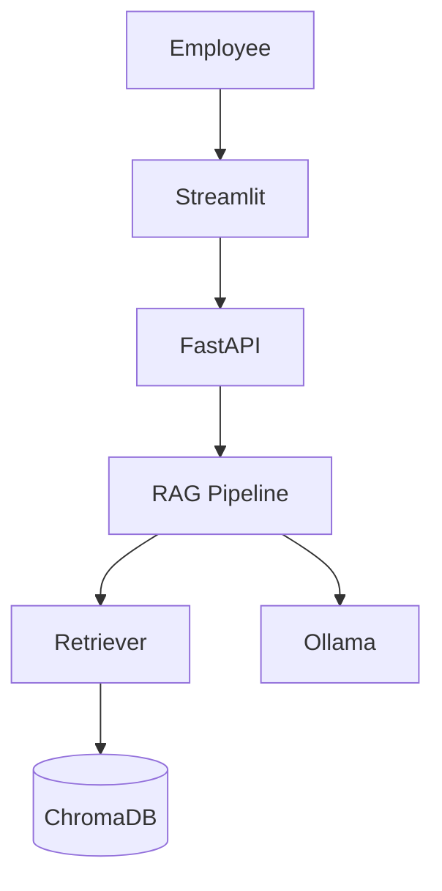
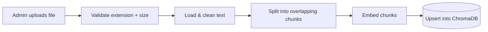
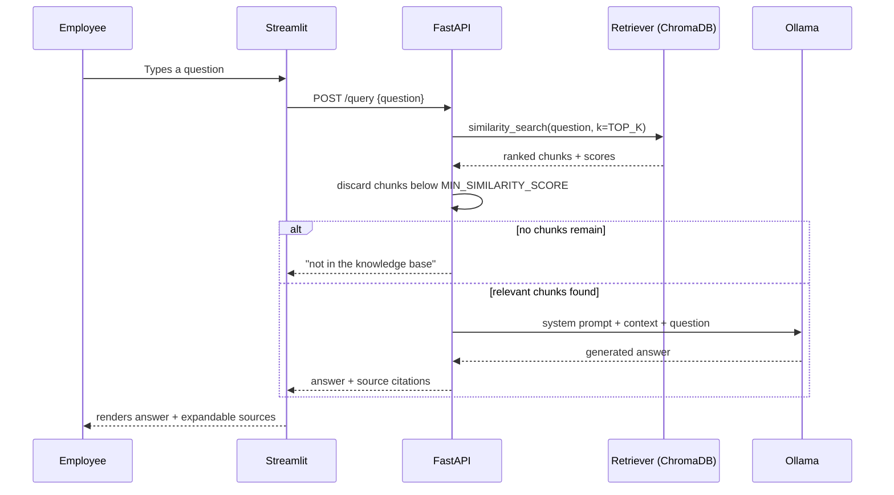
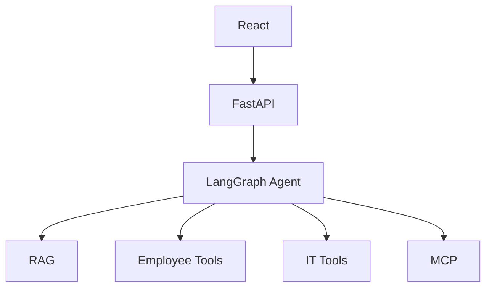

# Sage V0.1 — RAG MVP: Architecture

This document describes the **current** architecture of Sage. For the
step-by-step evolution plan, see [course-roadmap.md](course-roadmap.md).
For a line-by-line explanation of the retrieval/generation pipeline, see
[rag-pipeline.md](rag-pipeline.md).

## System overview

Sage V0.1 is a three-container Docker Compose stack. Every piece runs
locally on the host machine — there is no external API dependency.

| Layer | Technology | Container | Responsibility |
|---|---|---|---|
| UI | Streamlit | `frontend` | Chat interface, document upload/management, feedback widget |
| API | FastAPI | `backend` | Routing, validation, orchestration, error handling |
| RAG pipeline | Plain Python (`app/core/`) | `backend` | Ingestion and query orchestration |
| Retriever | ChromaDB client | `backend` (queries `ChromaDB`) | Similarity search over stored chunks |
| Vector store | ChromaDB | `backend` (persisted volume) | Stores chunk embeddings + metadata |
| Embeddings | sentence-transformers | `backend` | Local embedding model, no external calls |
| LLM | Ollama | `ollama` | Local generation, no external calls |

The `backend` and `ollama` containers communicate over Docker Compose's
internal bridge network (`kb-network`) by service name
(`http://ollama:11434`); the `frontend` reaches the `backend` the same way
(`http://backend:8000`).

## Document ingestion flow

- Supported formats: PDF, DOCX, TXT, Markdown.
- Chunk IDs are a stable hash of `source filename + chunk index`, so
  re-ingesting the same file with the same chunking settings overwrites
  the existing chunks instead of duplicating them.
- A file that yields no extractable text is rejected (HTTP 422) rather than
  silently indexed as empty.

## Query flow

The similarity-score filter is deliberate: small local LLMs are not
reliable at self-policing "only answer from the provided context" —
see `docs/rag-pipeline.md` → *Known limitations* for the full explanation.

## Where Sage is going

V0.1 is deliberately the simplest version that works end-to-end. The
course builds toward a more capable, agentic architecture:

None of the React frontend, LangGraph agent, tool layer, or MCP integration
exist yet — they are the subject of later course phases (see
`docs/course-roadmap.md`). This phase's job was only to make the V0.1
foundation clean and clearly documented before building on top of it.
