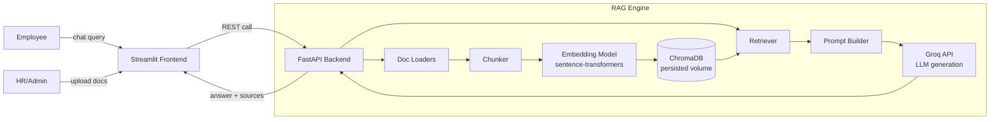

> This document reflects the original Sage RAG MVP build plan. The current
> course architecture and roadmap are documented in
> [`docs/course-roadmap.md`](../course-roadmap.md).
>
> **Historical note:** this plan was written when the project used the
> **Groq API** for LLM generation. The implementation has since moved to a
> **local LLM via Ollama** (no external API key required) — see
> [`docs/architecture.md`](../architecture.md) and
> [`docs/rag-pipeline.md`](../rag-pipeline.md) for how generation actually
> works today. Every mention of Groq below is preserved as-is for
> historical accuracy; it does not describe the current system.

---

# Intelligent Employee Knowledge Base (RAG) — Build Plan & Claude Code Prompts

A Dockerized RAG application: **Streamlit** frontend, **FastAPI** backend/RAG engine, **ChromaDB** vector store, **Groq API** for generation.

## How to use this document
1. Open the project folder in VS Code with the Claude Code extension.
2. Paste each numbered prompt below into Claude Code **in order**, one phase at a time.
3. Review, run, and test what Claude produces before moving to the next prompt — don't paste 5 prompts in a row blind.
4. Prompts assume the architecture and folder structure decided below. If you change something (e.g. swap Chroma for FAISS), edit the prompt text accordingly before pasting.

---

## 1. Architecture



**Query flow:** employee asks a question → backend embeds the query → retrieves top-k chunks from Chroma → builds a grounded prompt → Groq generates the answer → backend returns answer + source citations → Streamlit displays it.

**Ingestion flow:** admin uploads HR policy/SOP/handbook files → backend loads → chunks → embeds → stores in Chroma (persisted to a Docker volume).

> Note: Groq is fast for **generation** but does not host embedding models, so embeddings are generated locally with `sentence-transformers` (free, no extra API calls, works offline).

---

## 2. Tech Stack

| Layer | Choice | Why |
|---|---|---|
| Frontend | Streamlit | Fast to build a chat UI, easy to Dockerize |
| Backend API | FastAPI | Clean separation from UI, testable, async-friendly |
| LLM (generation) | Groq API (e.g. a current `llama-3.x` model — check the Groq console for the latest supported model name) | Very low-latency inference |
| Embeddings | `sentence-transformers/all-MiniLM-L6-v2` | Local, free, small, good enough for internal docs |
| Vector store | ChromaDB (persistent client, local volume) | Lightweight, no external service needed |
| Orchestration | Plain Python (optionally LangChain) | Keep it dependency-light and debuggable |
| Doc parsing | `pypdf`/`pdfplumber`, `python-docx` | PDF + Word support |
| Containerization | Docker + docker-compose | Two services (backend, frontend) + shared volume |

---

## 3. Folder Structure

```
employee-kb-rag/
├── backend/
│   ├── app/
│   │   ├── main.py
│   │   ├── api/
│   │   │   ├── routes_query.py
│   │   │   ├── routes_ingest.py
│   │   │   ├── routes_documents.py
│   │   │   └── routes_health.py
│   │   ├── core/
│   │   │   ├── config.py
│   │   │   ├── loaders.py
│   │   │   ├── chunking.py
│   │   │   ├── embeddings.py
│   │   │   ├── vectorstore.py
│   │   │   ├── retriever.py
│   │   │   ├── llm_groq.py
│   │   │   └── rag_pipeline.py
│   │   ├── models/
│   │   │   └── schemas.py
│   │   └── utils/
│   │       └── logger.py
│   ├── tests/
│   │   ├── test_chunking.py
│   │   ├── test_retriever.py
│   │   └── test_rag_pipeline.py
│   ├── requirements.txt
│   └── Dockerfile
├── frontend/
│   ├── streamlit_app.py
│   ├── components/
│   │   ├── chat_ui.py
│   │   ├── sidebar_upload.py
│   │   └── source_display.py
│   ├── requirements.txt
│   └── Dockerfile
├── data/
│   ├── raw_docs/          # sample HR policies, handbook, SOPs
│   └── chroma_db/         # persisted vector store (mounted volume)
├── docker-compose.yml
├── .env.example
├── .gitignore
└── README.md
```

---

## 4. Numbered Claude Code Prompts

### Phase 1 — Scaffolding

**Prompt 1 — Repo scaffold**
```
Create the initial folder and file structure for a project called "employee-kb-rag" exactly as follows:
[paste the folder structure from section 3 above]
Create every file as an empty or minimal placeholder (e.g. a docstring stating its purpose) so the structure exists and is importable. Also create a root .gitignore for a Python + Docker project (venv, __pycache__, .env, data/chroma_db, .streamlit).
```

**Prompt 2 — Config & settings**
```
In backend/app/core/config.py, create a Pydantic BaseSettings class named Settings that loads from environment variables / a .env file with these fields: GROQ_API_KEY (str), GROQ_MODEL (str, default "llama-3.3-70b-versatile"), EMBEDDING_MODEL (str, default "sentence-transformers/all-MiniLM-L6-v2"), CHROMA_PERSIST_DIR (str, default "/app/data/chroma_db"), CHUNK_SIZE (int, default 800), CHUNK_OVERLAP (int, default 120), TOP_K (int, default 5), MAX_UPLOAD_MB (int, default 20). Export a singleton `settings = Settings()`. Also create .env.example at the repo root listing all these variables with placeholder/default values (never a real API key).
```

### Phase 2 — Document Ingestion & Processing

**Prompt 3 — Document loaders**
```
In backend/app/core/loaders.py, implement functions to load text from PDF (using pypdf or pdfplumber), DOCX (using python-docx), and plain TXT/MD files. Provide a single entry point `load_document(file_path: str) -> str` that detects file type by extension and dispatches accordingly, raising a clear ValueError for unsupported types. Add basic cleanup (strip excessive whitespace/blank lines). Update backend/requirements.txt with the needed packages.
```

**Prompt 4 — Chunking**
```
In backend/app/core/chunking.py, implement a function `chunk_text(text: str, chunk_size: int, chunk_overlap: int, metadata: dict) -> list[dict]` that splits text into overlapping chunks (character or token based, your choice, but respect chunk_size/overlap) and returns a list of {"text": ..., "metadata": {...}} where metadata includes at least the source filename and a chunk index. Use settings.CHUNK_SIZE and settings.CHUNK_OVERLAP as defaults. Add a unit test in backend/tests/test_chunking.py covering: normal text, text shorter than chunk_size, and empty text.
```

**Prompt 5 — Embeddings + vector store**
```
In backend/app/core/embeddings.py, wrap sentence-transformers: load settings.EMBEDDING_MODEL once at module level and expose `embed_texts(texts: list[str]) -> list[list[float]]` and `embed_query(text: str) -> list[float]`.

In backend/app/core/vectorstore.py, wrap a persistent ChromaDB client pointed at settings.CHROMA_PERSIST_DIR with a single collection "employee_kb". Implement:
- `add_chunks(chunks: list[dict])` — embeds and upserts chunks with metadata and a stable id (hash of source+chunk_index).
- `similarity_search(query: str, k: int) -> list[dict]` — returns top-k chunks with text, metadata, and score.
- `list_sources() -> list[str]` — distinct source filenames currently indexed.
- `delete_source(filename: str)` — removes all chunks for a given source file.
```

**Prompt 6 — Ingestion pipeline function**
```
In backend/app/core/rag_pipeline.py, implement `ingest_document(file_path: str, original_filename: str) -> dict` that: loads the document (loaders.py), chunks it (chunking.py) with metadata={"source": original_filename}, adds the chunks to the vector store (vectorstore.py), and returns a summary dict {"filename":..., "chunks_added": int}. Raise a clear exception if the file yields no extractable text.
```

### Phase 3 — Retrieval & Generation

**Prompt 7 — Groq LLM wrapper**
```
In backend/app/core/llm_groq.py, implement a thin wrapper around the Groq Python SDK (or raw HTTPS calls if the SDK isn't available) using settings.GROQ_API_KEY and settings.GROQ_MODEL. Expose `generate_answer(system_prompt: str, user_prompt: str, temperature: float = 0.2) -> str`. Handle and surface API errors (auth, rate limit, timeout) as a custom RAGGenerationError rather than letting raw exceptions bubble up. Add Groq's SDK to backend/requirements.txt.
```

**Prompt 8 — RAG query pipeline with citations**
```
In backend/app/core/rag_pipeline.py, implement `answer_query(query: str) -> dict` that:
1. Retrieves top settings.TOP_K chunks via vectorstore.similarity_search.
2. Builds a system prompt instructing the model to answer ONLY using the provided context, to say clearly when the answer isn't in the context rather than guessing, and to keep the tone professional/HR-appropriate.
3. Builds a user prompt embedding the retrieved chunks (labelled [1], [2], ...) plus the employee's question.
4. Calls llm_groq.generate_answer.
5. Returns {"answer": str, "sources": [{"filename":..., "chunk_index":...}, ...]} deduplicated by source file.
If no chunks are retrieved (empty knowledge base or no relevant match), return a friendly "I couldn't find this in the knowledge base" answer instead of calling the LLM. Add backend/tests/test_rag_pipeline.py with a mocked vectorstore and mocked llm_groq call to test both the grounded-answer path and the no-match path.
```

### Phase 4 — Backend API (FastAPI)

**Prompt 9 — Pydantic schemas**
```
In backend/app/models/schemas.py, define Pydantic models: QueryRequest (question: str), QueryResponse (answer: str, sources: list[SourceRef]), SourceRef (filename: str, chunk_index: int), IngestResponse (filename: str, chunks_added: int), DocumentListResponse (sources: list[str]), HealthResponse (status: str, groq_configured: bool, indexed_documents: int).
```

**Prompt 10 — FastAPI routes**
```
Implement:
- backend/app/api/routes_health.py — GET /health returning HealthResponse.
- backend/app/api/routes_ingest.py — POST /ingest accepting a multipart file upload, validating extension (.pdf/.docx/.txt/.md) and size against settings.MAX_UPLOAD_MB, saving to a temp path, calling rag_pipeline.ingest_document, and returning IngestResponse. Return proper 4xx errors for invalid files.
- backend/app/api/routes_query.py — POST /query accepting QueryRequest and returning QueryResponse via rag_pipeline.answer_query.
- backend/app/api/routes_documents.py — GET /documents (list indexed sources) and DELETE /documents/{filename} (remove a source from the index).

In backend/app/main.py, create the FastAPI app, enable CORS for the Streamlit frontend's origin, and include all four routers. Add a startup event that logs whether GROQ_API_KEY is set.
```

**Prompt 11 — Logging & error handling**
```
In backend/app/utils/logger.py, set up a basic structured logger (module name, level from an env var LOG_LEVEL, default INFO). Wire it into main.py, rag_pipeline.py, and llm_groq.py to log: ingestion events, query events (question length, num sources retrieved, latency), and errors. Add a FastAPI exception handler in main.py that catches unhandled exceptions and returns a clean 500 JSON error instead of a stack trace.
```

### Phase 5 — Frontend (Streamlit)

**Prompt 12 — Chat UI**
```
In frontend/streamlit_app.py and frontend/components/chat_ui.py, build a chat interface using st.chat_message/st.chat_input. On each user question, POST to the backend's /query endpoint (backend URL from an env var BACKEND_URL, default http://backend:8000) and render the assistant's answer. Maintain chat history in st.session_state so the conversation persists across reruns within a session. Show a spinner while waiting for the backend response, and a clear error message if the backend call fails.
```

**Prompt 13 — Document upload sidebar (admin)**
```
In frontend/components/sidebar_upload.py, add a sidebar section "Manage Knowledge Base" with: a file_uploader accepting pdf/docx/txt/md, an "Upload" button that POSTs the file to the backend's /ingest endpoint and shows a success/error toast with the number of chunks added; a list of currently indexed documents fetched from GET /documents, each with a "Remove" button calling DELETE /documents/{filename}. Wire this component into streamlit_app.py.
```

**Prompt 14 — Source citations display**
```
In frontend/components/source_display.py, add a small expandable "Sources" section under each assistant chat bubble that lists the filenames returned in QueryResponse.sources. Update chat_ui.py to use this component for every assistant message.
```

### Phase 6 — Dockerization

**Prompt 15 — Backend Dockerfile**
```
Write backend/Dockerfile: python:3.11-slim base, install backend/requirements.txt, copy the backend/app code, expose port 8000, run with uvicorn app.main:app --host 0.0.0.0 --port 8000. Use a non-root user and enable pip caching layers sensibly (copy requirements.txt before the rest of the code).
```

**Prompt 16 — Frontend Dockerfile**
```
Write frontend/Dockerfile: python:3.11-slim base, install frontend/requirements.txt, copy the frontend code, expose port 8501, run with streamlit run streamlit_app.py --server.address=0.0.0.0 --server.port=8501.
```

**Prompt 17 — docker-compose.yml**
```
Write docker-compose.yml at the repo root with two services:
- backend: build ./backend, env_file .env, ports "8000:8000", volume mapping ./data/chroma_db:/app/data/chroma_db (persist the vector store) and ./data/raw_docs:/app/data/raw_docs, healthcheck hitting /health.
- frontend: build ./frontend, environment BACKEND_URL=http://backend:8000, ports "8501:8501", depends_on backend (condition: service_healthy).
Both services on a shared bridge network. Add a top-level comment explaining how to run: `docker compose up --build`.
```

**Prompt 18 — Env & git hygiene**
```
Finalize .env.example at the repo root with every variable used by both services (GROQ_API_KEY, GROQ_MODEL, BACKEND_URL, LOG_LEVEL, etc.). Double check .gitignore excludes .env, data/chroma_db/*, __pycache__, and any local venvs.
```

### Phase 7 — Testing & Quality

**Prompt 19 — Retriever unit tests**
```
In backend/tests/test_retriever.py, write unit tests for vectorstore.py's add_chunks / similarity_search / delete_source using a temporary Chroma persist directory (pytest tmp_path fixture) so tests don't touch the real data/chroma_db. Cover: adding then retrieving relevant chunks, empty collection returns empty results, delete_source removes only the targeted source's chunks.
```

**Prompt 20 — End-to-end smoke test**
```
Create backend/tests/test_e2e_smoke.py (or a standalone script scripts/smoke_test.py) that, against a running docker-compose stack: ingests a small sample text file via POST /ingest, asks a question via POST /query that should be answerable from that file, and asserts the response contains a non-empty answer and at least one matching source. Print a clear PASS/FAIL summary.
```

### Phase 8 — Documentation & Sample Data

**Prompt 21 — Sample HR documents**
```
Create 2-3 short sample documents in data/raw_docs/ (e.g. leave_policy.md, code_of_conduct.md, it_helpdesk_sop.md) with realistic but generic HR/SOP content, so the knowledge base has something to query out of the box.
```

**Prompt 22 — README**
```
Write a root README.md covering: project description, architecture summary (reuse the mermaid diagram), prerequisites (Docker, a Groq API key), setup steps (copy .env.example to .env and fill in GROQ_API_KEY, docker compose up --build), how to upload documents via the UI, how to ask questions, how to run tests, and a troubleshooting section (common Groq auth errors, empty knowledge base behavior, port conflicts).
```

### Phase 9 — Optional Enhancements

**Prompt 23 — Feedback capture (optional)**
```
Add a thumbs up/down control under each assistant answer in the Streamlit chat UI. On click, POST to a new backend endpoint POST /feedback {question, answer, rating, sources} that appends a JSON line to data/feedback.log. This gives you a lightweight signal for later improving retrieval/prompting.
```

**Prompt 24 — Basic access control (optional)**
```
Add a simple shared-password gate to the Streamlit app (st.text_input with type="password" compared against an env var APP_PASSWORD) so the internal tool isn't wide open, without building full user auth. Document this limitation clearly in the README as MVP-only, not a real auth system.
```

---

## 5. Suggested Build Order Recap

1. Phase 1 (scaffold + config) → verify structure exists.
2. Phase 2 (ingestion pipeline) → test loading/chunking/storing a sample file locally, no Docker yet.
3. Phase 3 (retrieval + Groq generation) → test a query end-to-end in a plain Python shell before wiring the API.
4. Phase 4 (FastAPI) → test with `curl`/Swagger UI at `/docs`.
5. Phase 5 (Streamlit) → run frontend against local backend (no Docker yet).
6. Phase 6 (Docker) → containerize both, bring up with docker-compose.
7. Phase 7 (tests) → lock in confidence before calling it done.
8. Phase 8 (docs + sample data) → make it usable by someone else.
9. Phase 9 (optional) → only if time allows.
